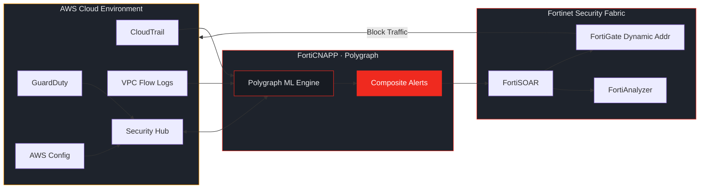

# CNAPP on AWS — Three-Way Platform Comparison

> **Side-by-side comparison of three CNAPP approaches on AWS.**
> **AWS Native** supplies guardrails and preventive controls. **Datadog** bundles CNAPP into the observability platform. **FortiCNAPP** delivers unified cloud security with closed-loop enforcement via the **Fortinet Security Fabric**.

---

## Table of Contents

- [Executive Summary](#executive-summary)
- [1. The Three Stacks](#1--the-three-stacks)
- [2. Capability Parity Matrix](#2--capability-parity-matrix)
- [3. Strengths & Gaps](#3--strengths--gaps)
- [4. Recommendation by Profile](#4--recommendation-by-profile)
- [5. Decision Graph](#5--decision-graph)
- [Final Verdict](#final-verdict)
- [References](#references)

---

## Executive Summary

| Platform | Score | One-Line Position |
|---|---|---|
|  | **39 / 80** | AWS-native guardrails, preventive controls, first-party integration |
|  | **50 / 80** | Observability + security in one agent; high TCO at scale |
|  | **68 / 80** | Unified multi-cloud CNAPP + closed-loop enforcement via Fortinet Security Fabric |

> [!TIP]
> **FortiCNAPP leads on 10 of 14 capability rows.** The enterprise production pattern layers FortiCNAPP on top of AWS-native preventive guardrails. Datadog fits dev-led teams already paying for the observability platform.

---

## 1 · The Three Stacks

### 🟠 Stack A — AWS Native Suite · *Assembled*

| Tier | Service |
|---|---|
| Hub | Security Hub CSPM |
| CSPM | AWS Config |
| Audit | CloudTrail |
| Threat | GuardDuty |
| CWPP | Inspector |
| Graph | Detective |
| Data | Macie |
| CIEM | Access Analyzer |
| Preventive | Control Tower · SCPs |
| Automation | EventBridge · Lambda |

### 🟣 Stack B — Datadog CNAPP · *Bundled*

| Tier | Service |
|---|---|
| Platform | Observability Data Lake |
| CSPM | 1000+ OOTB Rules |
| KSPM | CIS · EKS / AKS / GKE |
| CWPP | Datadog Agent |
| CIEM | IAM Risk · AWS · Azure · GCP |
| CDR | Cloud SIEM · Signals |
| Triage | Security Inbox |
| Code | SAST · SCA · IAST |
| AppSec | Runtime AppSec · RASP |
| Workflow | Workflows · Jira |

### 🔴 Stack C — FortiCNAPP · *Unified*

| Tier | Service |
|---|---|
| Platform | Polygraph Data Platform |
| CSPM | Multi-Cloud Posture |
| CWPP | Agent + Agentless |
| CIEM | Cross-Cloud CIEM |
| CDR | Composite Alerts |
| Code | SCA · SAST · IaC |
| Container | Image · Runtime · K8s |
| Fabric | **Fortinet Security Fabric** |
| Response | FortiSOAR Playbooks |
| Audit | Native Log Ingest |

---

## 2 · Capability Parity Matrix

Legend: ✅ full &nbsp; 🟡 partial &nbsp; ❌ gap

| Capability | 🟠 AWS Native | 🟣 Datadog | 🔴 FortiCNAPP | 🏆 Winner |
|---|---|---|---|---|
| **Multi-cloud CSPM** | ❌ AWS only | ✅ AWS · Azure · GCP | ✅ AWS · Azure · GCP · OCI | **FortiCNAPP** |
| **Runtime CWPP** | 🟡 Network-layer only | ✅ Agent · process · file | ✅ Agent + agentless · K8s | **FortiCNAPP** |
| **Vulnerability scan** | ✅ Inspector | ✅ Host · container · Lambda | ✅ + runtime exploitability | **FortiCNAPP** |
| **CIEM depth** | 🟡 Access Analyzer | ✅ IAM risks · remediation | ✅ Effective-vs-used · toxic combos | **FortiCNAPP** |
| **Composite alerts** | ❌ None | 🟡 Security Inbox | ✅ Polygraph ML | **FortiCNAPP** |
| **Observability correlation** | ❌ CloudWatch only | ✅ APM · logs · metrics | ❌ Not primary use-case | **Datadog** |
| **Compliance frameworks** | ✅ AFSBP · CIS · PCI | ✅ CIS · PCI · HIPAA · SOC2 | ✅ + custom authoring | *Tie* |
| **IaC · code scanning** | ❌ No native scanner | ✅ SAST · SCA · IAST | ✅ SCA · SAST · IaC · VS Code | *Tie* |
| **Kubernetes coverage** | 🟡 EKS only | ✅ EKS · AKS · GKE | ✅ EKS · AKS · GKE · OKE | **FortiCNAPP** |
| **Auto-remediation** | 🟡 DIY EventBridge | 🟡 Workflows · Jira | ✅ FortiSOAR playbooks | **FortiCNAPP** |
| **Detection → enforcement** | ❌ Detection only | ❌ Detection only | ✅ FortiGate dynamic | **FortiCNAPP** |
| **Preventive guardrails** | ✅ SCPs · Control Tower | ❌ Detective only | ❌ Detective only | **AWS** |
| **Native AWS integration** | ✅ First-party zero-lag | ✅ Deep agent telemetry | 🟡 Cross-account roles | **AWS** |
| **Pricing predictability** | 🟡 Per-event compounds | ❌ Per-host · high TCO | ✅ Platform subscription | **FortiCNAPP** |

**Tally:** FortiCNAPP 10 · AWS 2 · Datadog 1 · Tie 2

---

## 3 · Strengths & Gaps

### 🟠 AWS Native Suite

<table>
<tr>
<td valign="top" width="50%">

**✅ Strengths**

- Zero integration friction — same IAM, VPC, org
- Preventive controls — SCPs, Control Tower
- Real-time API hooks — CloudTrail, EventBridge
- Low starting cost — minimal floor
- First-party data fidelity
- Auditor-friendly conformance packs
- Single vendor on procurement

</td>
<td valign="top" width="50%">

**❌ Gaps**

- Stops at the AWS border
- Aggregates but does not correlate
- Shallow CIEM — no blast radius
- No runtime workload behavior
- Customer builds all remediation
- Pricing compounds at scale
- No native IaC scanner

</td>
</tr>
</table>

### 🟣 Datadog CNAPP

<table>
<tr>
<td valign="top" width="50%">

**✅ Strengths**

- Single agent for observability + security
- APM · logs · metrics · security in one UI
- Security Inbox — noise reduction
- Strong CIEM with remediation paths
- Multi-cloud — AWS · Azure · GCP
- Code Security — SAST, SCA, IAST
- Runtime AppSec / RASP capabilities
- Developer-friendly — already familiar

</td>
<td valign="top" width="50%">

**❌ Gaps**

- Per-host pricing — high TCO at scale
- Unpredictable billing — custom metrics, retention
- No network enforcement loop
- No preventive controls
- Security depth behind Wiz/Prisma/FortiCNAPP
- Ranked 7th in CSPM by PeerSpot
- No OCI support
- Vendor lock-in to observability bill

</td>
</tr>
</table>

### 🔴 FortiCNAPP

<table>
<tr>
<td valign="top" width="50%">

**✅ Strengths**

- Composite alerts — 80–95% reduction
- True multi-cloud — AWS · Azure · GCP · OCI
- Deep CIEM — effective-vs-used, blast radius
- Runtime behavioral CWPP
- Integrated SCA · SAST · IaC · VS Code
- **Fortinet Security Fabric** — closed-loop enforcement
- Bidirectional Security Hub integration
- Predictable platform subscription

</td>
<td valign="top" width="50%">

**⚠️ Limitations**

- Detective only — no preventive controls
- Detection latency up to 3 hrs on anomalies
- UI maturity — value in API/CLI
- Slow feature cycles (>12 months)
- Onboarding lift — IAM + log wiring
- Extra line item
- Limited China coverage
- No SCIM at time of writing

</td>
</tr>
</table>

---

## 4 · Recommendation by Profile

| Customer Profile | Recommendation |
|---|---|
| AWS-only · <5 accounts · budget-sensitive |  |
| AWS-only · enterprise · regulated · mature SecOps |  |
| AWS + Azure or GCP · multi-cloud footprint |  |
| Heavy Kubernetes · multi-flavor deployment |  |
| Existing Fortinet customer · FortiGate/FortiWeb |  |
| SOC drowning in cloud alerts |  |
| Dev-led org · Datadog already deployed · small scale |  |
| Observability & security consolidation priority |  |
| Preventive-first · FedRAMP · Zero Trust mandate |  |
| Large enterprise · OCI in scope · cost control |  |

---

## 5 · Decision Graph

### Weighted Scorecard · Axis-by-Axis (0–10)

| Axis | 🟠 AWS | 🟣 Datadog | 🔴 FortiCNAPP |
|---|---|---|---|
| Multi-Cloud | ██░░░░░░░░ `2` | █████████░ `9` | ██████████ `10` |
| CIEM | ████░░░░░░ `4` | ███████░░░ `7` | █████████░ `9` |
| Alert Composite | ██░░░░░░░░ `2` | ██████░░░░ `6` | ██████████ `10` |
| Runtime | █████░░░░░ `5` | ████████░░ `8` | █████████░ `9` |
| Code · IaC | ███░░░░░░░ `3` | ███████░░░ `7` | █████████░ `9` |
| Preventive Guardrails | ██████████ `10` | ███░░░░░░░ `3` | ████░░░░░░ `4` |
| Native Integration | ██████████ `10` | ██████░░░░ `6` | ███████░░░ `7` |
| **Fortinet Security Fabric** | ███░░░░░░░ `3` | ████░░░░░░ `4` | ██████████ `10` |
| **Total** | **39 / 80** | **50 / 80** | **68 / 80** |

### Capability Radar

```mermaid
%%{init: {"theme": "dark", "themeVariables": {"xyChart": {"backgroundColor": "#0A0C10", "titleColor": "#E8EAED", "xAxisLabelColor": "#A0A6B0", "yAxisLabelColor": "#A0A6B0", "plotColorPalette": "#FF9900, #8B5FBF, #EF2A1F"}}}}%%
xychart-beta
    title "Capability Score by Axis (0–10)"
    x-axis ["Multi-Cloud", "CIEM", "Composite", "Runtime", "Code/IaC", "Preventive", "Native", "Fabric"]
    y-axis "Score" 0 --> 10
    bar [2, 4, 2, 5, 3, 10, 10, 3]
    bar [9, 7, 6, 8, 7, 3, 6, 4]
    bar [10, 9, 10, 9, 9, 4, 7, 10]
```

> **Legend:** 🟠 Bar 1 = AWS Native · 🟣 Bar 2 = Datadog · 🔴 Bar 3 = FortiCNAPP

### Production Integration Pattern

---

## Final Verdict

> [!IMPORTANT]
> ### Scores
>
> | 🟠 AWS Native | 🟣 Datadog | 🔴 FortiCNAPP |
> |:---:|:---:|:---:|
> | **39 / 80** | **50 / 80** | **68 / 80** |
>
> **FortiCNAPP leads on 10 of 14 capability rows.**
> Datadog is the strongest choice when observability and security must share one agent and one bill. AWS Native owns preventive guardrails and first-party integration. The enterprise production pattern layers FortiCNAPP on top of AWS-native guardrails, reserving Datadog for dev-led teams already paying for the observability platform.

---

## Recommended Demo Flow

1. **Polygraph composite alert** — compromised identity walkthrough
2. **CIEM effective-vs-used** — permissions on a Lambda role
3. **Side-by-side finding** — Security Hub ⇄ FortiCNAPP
4. **FortiSOAR playbook** — isolating an EC2 via FortiGate (Fortinet Security Fabric)
5. **TCO comparison** — Datadog per-host vs FortiCNAPP platform subscription

---

## References

| Source | Link |
|---|---|
| AWS Security Hub CSPM | <https://aws.amazon.com/security-hub/cspm> |
| Datadog Cloud Security | <https://docs.datadoghq.com/security/cloud_security_management/> |
| FortiCNAPP Product Page | <https://www.fortinet.com/products/forticnapp> |
| FortiCNAPP Release Notes | FortiCNAPP · Feb 2026 |
| FortiGuard Labs — Cloud IDS | <https://www.fortinet.com/blog/threat-research> |
| Gartner Peer Insights · FortiCNAPP | <https://www.gartner.com/reviews/product/forticnapp> |
| KuppingerCole CNAPP Leadership Compass | 2025 · FortiCNAPP = Leader |
| PeerSpot CSPM Mindshare Report | Jan 2026 |

---

**Prepared by:** Fortinet PreSales · DevSecOps Engineering &nbsp;·&nbsp; **Doc ID:** `CNAPP-AWS-02` &nbsp;·&nbsp; **Rev:** April 2026 &nbsp;·&nbsp; **Classification:** Internal

*Fortinet Red · #EF2A1F · PMS 485 C*
